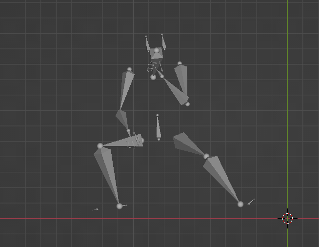

# pose3d to bvh

这个repo主要是把 openpose中body25格式，或者body25加上手部姿势的keypoints，转换成bvh。

目前已有的转换大多是h36的，在此更新body25和手势。本项目可以帮助那些使用openpose或者body25作为骨骼结构的同学，做bvh的粗略生成。

注：3d keypoints转换bvh只能做到大概的姿势相似，可以通过相对位置计算子节点相对于父节点的欧拉角，但是，对于人体骨骼而言，其自旋仅凭keypoints是无法或者很难精确算出的，需要其他先验知识，在这里就不展开了。

This repo mainly converts the body25 format in openpose, or body25 plus the key points of the hand posture, into bvh.

Most of the repos in github are about h36 skeleton, thus I update the body25 one. This project can help guys who use openpose or body25 skeleton as a tool to do rough generation of bvh.

Note: 3d keypoints converting into bvh can only achieve approximate pose similarity, but the relative position calculation can only calculate the Euler angle of the parent node. For human skeleton, relatively speaking, keypoints are unrealistic to convert to bvh exactly. It requires other prior knowledge to assist, and it will not be expanded here.

